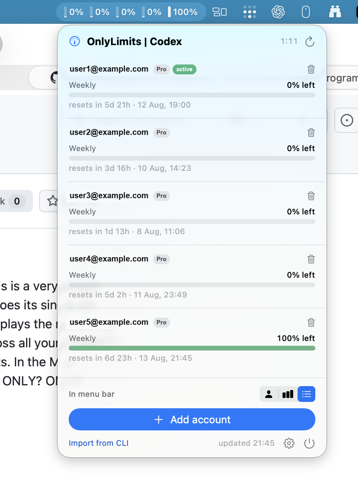

<div align="center">

[English](README.md) · [Русский](README.ru.md) · **日本語** · [中文](README.zh.md)

# OnlyLimits

**すべての Codex アカウントの利用上限を一目で確認 - macOS のメニューバーで。**

一つの仕事を、しっかりとこなす。ネイティブ。極小。バックグラウンド負荷はゼロ。


<br>



</div>

---

> _このアプリは自分のために作りました。余計な機能が山ほど付いていない代替品が見つからなかったからです。ただ自分の上限がどれくらい残っているかを知りたかっただけで、必要のないもので Mac を重くしたくなかったのです。_

## これは何か

**Codex (ChatGPT) の利用上限がどれだけ残っているか**を表示する、シンプルに機能を絞った macOS の**メニューバーアプリ**です。しかも**所有するすべてのアカウントを同時に**表示します。アカウントの切り替えも、ダッシュボードも、クリックの奥に埋もれたアカウントもありません。メニューバーをちらっと見て、残りを確認し、作業に戻る。

やることはたった一つ。しかもその間、あなたの邪魔をしません。

## なぜ別の利用状況トラッカーを?

ほとんどのトラッカーはローカルの Codex CLI を読み取りますが、CLI は一度に**一つ**のアカウントにしかログインできないため、そのアカウントしか表示できません。切り替え型のツールはアクティブなアカウントを一つだけ表示し、ローテーションを強います。**OnlyLimits は各アカウント自身の認証情報を保持し、それぞれ独立してポーリングします**。だからあなたのすべてのアカウントを*同時に*確認できます - これが意外と見つからない機能なのです。

そしてシステムに溶け込むように作られています。**940 KB** のバイナリ、**外部依存なし**、そして**アイドル時の CPU 使用率は約 0%**（数分ごとの更新時にのみ動作します）。

## 機能

| | |
|---|---|
| 🧮 **すべてのアカウントを一度に** | 追加した Codex アカウントはそれぞれ独立してポーリングされ、まとめて表示されます - アカウントごとの残り %、リセット時刻。 |
| 🔐 **Sign in with ChatGPT** | 公式のブラウザ OAuth フロー（PKCE）を使って、アプリから直接アカウントを追加。`codex login` のやりくりも、トークンの貼り付けも不要。好きなだけ追加できます。 |
| 📊 **カスタムメニューバーミニチャート** | 数字を詰め込んだ文字列ではなく、システムモニターのような手描きのステータスグラフィック。3 つの表示モード（後述）。 |
| 🟢 **使用量ではなく残量** | バーは**残っている量**を表示します。満タンで緑 = 余裕あり、空で赤 = ほぼ底。あなたが本当に気にする数値です。 |
| ⏱️ **リアルタイム更新カウントダウン** | 次の自動更新までの残り時間を正確に表示。ワンクリックで今すぐ更新も可能。 |
| 🌍 **4 言語対応** | Русский · English · 日本語 · 中文 - 歯車メニューから即座に切り替え。 |
| 🪶 **羽のように軽量** | ネイティブ SwiftUI、依存関係ゼロ、Electron/Node/Python は不使用。CPU 負荷はごくわずか、バイナリは極小。 |
| 🔒 **ローカルかつプライベート** | 通信先は OpenAI のエンドポイントのみ。認証情報が Mac から出ることはありません。アナリティクスも、サーバーも、テレメトリもありません。 |

### 3 つのメニューバーモード

パネル下部のセグメントトグルから選択します:

| アイコン | モード | メニューバーの表示 |
|:---:|---|---|
| 👤 | **アクティブ** | Codex CLI が現在ログインしているアカウント - ゲージ 1 つ + その % |
| 📊 | **すべて（バー）** | アカウントごとにゲージ 1 つ、コンパクト、数字なし |
| ☰ | **すべて + 数字** | アカウントごとにゲージ 1 つ、それぞれの横に残り % を表示 |

メニューバーのグラフィックは**テンプレート画像**なので、macOS が自動的に色を調整します - 暗いメニューバーでは鮮明な白、明るいメニューバーでは黒。パネル内ではバーは**カラー**のまま（柔らかい緑 → 黄 → 赤）で、派手すぎることなく一目で状態が分かります。

## インストール

### 必要環境
- macOS 14 (Sonoma) 以降
- Xcode 16+ / Swift 6 ツールチェーン（ソースからビルドする場合）
- [Codex CLI](https://github.com/openai/codex) をインストールし、少なくとも一度ログインしておくこと（最初のアカウントの取り込みに使用します。以降のアカウントはアプリ内で追加します）

### ソースからビルド
```bash
git clone <your-repo-url> codex-usage-bar
cd codex-usage-bar
./build.sh                 # → OnlyLimits.app (ad-hoc signed, dock-less)
open OnlyLimits.app
```

他のアプリと同じようにインストールし、自動起動を有効にします:
```bash
cp -R OnlyLimits.app /Applications/
# System Settings → General → Login Items → add OnlyLimits
```

## 使い方

1. **起動する。** 初回起動時に、Codex CLI が現在ログインしているアカウントを取り込みます。
2. **アカウントを追加する。** **Add account** をクリック → ブラウザで ChatGPT にサインイン → 完了。アカウントごとに繰り返します。
   - ログインは毎回新規サインインを強制する（`prompt=login`）ため、毎回*別の*アカウントを追加できます。
   - ログインの途中で気が変わった? ボタンはキャンセルに変わるので、ワンクリックで元に戻ります。
3. **上限を確認する。** 各アカウントは、その期間（例: *週次*）を**残量**バーとリセットまでのカウントダウンで表示します。
4. **メニューバーモード**（👤 / 📊 / ☰）と**言語**（⚙️）を選ぶ - どちらも起動をまたいで記憶されます。
5. その行の 🗑 をクリックして**アカウントを削除**します。

## 仕組み

- **アカウント**は Codex ログインのスナップショットです: `access_token` + `refresh_token` + `account_id`。各アカウント自身の**リフレッシュトークン**を保持していることが、CLI がどのアカウントにあるかに関係なく、独立した同時ポーリングを可能にしています。
- **利用状況**は `GET https://chatgpt.com/backend-api/wham/usage`（`Authorization: Bearer …`、`ChatGPT-Account-Id: …`）から取得します。レスポンスには `email`、`plan_type`、レート制限の各期間が含まれるため、各アカウントは自身にラベルを付けられます。
- **トークン**は `POST https://auth.openai.com/oauth/token` で更新されます - 有効期限が近づくと事前に、また 401 が返ると事後的に 1 回リトライします。
- 各期間はその**実際の長さ**に基づいてラベル付けされるため、アプリは常に実態を反映します（Codex は現在、週次の期間を公開しています。5 時間の期間が返された場合も正しく表示されます）。

## パフォーマンスとフットプリント

ビルド済みアプリのアイドル時に計測:

| 指標 | 値 |
|---|---|
| バイナリサイズ | **940 KB** |
| アプリバンドル | **~1 MB** |
| 外部依存 | **0** |
| アイドル時 CPU | **~0%**（数分ごとの更新時にのみ動作） |
| ランタイム | ネイティブ SwiftUI / AppKit - Electron、Node、Python は不使用 |
| Dock アイコン | なし（`LSUIElement`）- メニューバーのみに常駐 |

## プライバシーとセキュリティ

- 通信先は `chatgpt.com` と `auth.openai.com` **のみ**。サードパーティのサーバー、アナリティクス、テレメトリはありません。
- 認証情報は `~/Library/Application Support/OnlyLimits/accounts.json` にローカル保存され、パーミッションは `0600` です - これはあなたのマシンの `~/.codex/auth.json` に既に存在するのと同種の機密情報です。
- どこにも何もアップロードされません。すべてはあなたの Mac 上で動作します。
- _今後の強化:_ トークンのフィールドを Keychain へ移行する予定です。

## プロジェクト構成

```
Sources/OnlyLimits/
├── OnlyLimitsApp.swift    # @main - MenuBarExtra + status-bar image
├── MenuContentView.swift     # the panel UI (rows, bars, modes, countdown, language)
├── StatusBarImage.swift      # hand-drawn menu-bar mini bar chart + color palette
├── UsageStore.swift          # polling, timer, modes, orchestration
├── CodexLogin.swift          # Sign in with ChatGPT (browser OAuth, PKCE)
├── OAuthCallbackServer.swift # localhost callback listener
├── PKCE.swift                # PKCE codes
├── CodexClient.swift         # usage + token-refresh requests
├── AccountStore.swift        # persistence
├── AuthImport.swift          # read ~/.codex/auth.json, detect active account
├── Models.swift              # API response + normalized model
└── Localization.swift        # ru / en / ja / zh strings
```

## 免責事項

これは**非公式**の独立したツールです。OpenAI との提携、承認、サポートはありません。公式の Codex CLI と同じ公開 OAuth クライアントおよび利用状況エンドポイントを使用しており、**自分が所有するアカウントでの個人利用**を想定しています。エンドポイントはいつでも変更される可能性があります。

## ライセンス

MIT - [LICENSE](LICENSE) を参照してください。
