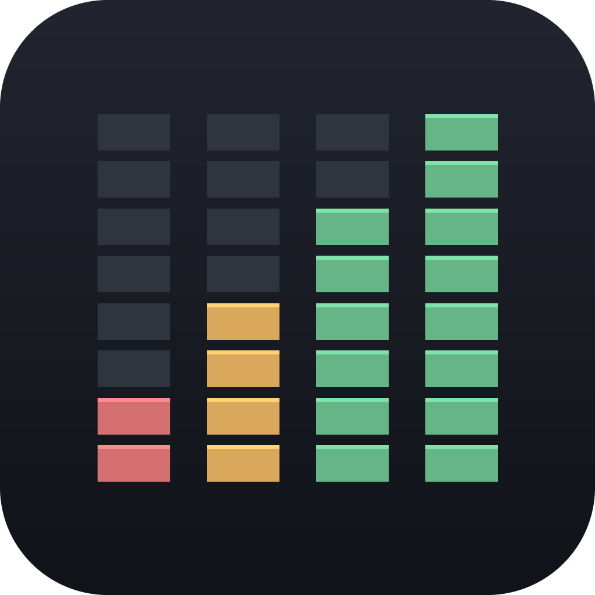

<div align="center">

**English** · [Русский](README.ru.md) · [日本語](README.ja.md) · [中文](README.zh.md)



# OnlyLimits

**See the usage limits of all your Codex accounts at once - right in the macOS menu bar.**

One job, done well. Native. Tiny. Zero background load.

**[⬇ Download OnlyLimits 1.1 (.dmg)](https://github.com/Glym143/onlylimits/releases/latest)**


<br>


</div>

---

> _I made this app for myself, because I couldn't find an alternative without a pile of extra functionality. I just wanted to see how much of my limits I had left - and not weigh my Mac down with junk I don't need._

## What it is

A focused macOS **menu-bar app** that shows how much of your **Codex (ChatGPT) usage limit is left** - for **every account you own, simultaneously**. No account switching, no dashboards, no accounts buried behind clicks. Glance at the menu bar, see what's left, get back to work.

It does exactly one thing, and it stays out of your way while doing it.

## Why another usage tracker?

Most trackers read the local Codex CLI, which is logged into **one** account at a time - so they can only ever show that one. Switchers show one active account and make you rotate. **OnlyLimits keeps each account's own credentials and polls them independently**, so all of your accounts are visible *at the same time* - the thing that's surprisingly hard to find.

And it's built to disappear into the system: a **940 KB** binary, **no external dependencies**, and **~0% CPU at idle** (it only wakes to refresh every few minutes).

## Features

| | |
|---|---|
| 🧮 **All accounts at once** | Every Codex account you add is polled independently and shown together - remaining %, reset time, per account. |
| 🔐 **Sign in with ChatGPT** | Add accounts straight from the app via the official browser OAuth flow (PKCE). No `codex login` juggling, no pasting tokens. Add as many as you like. |
| 📊 **Custom menu-bar mini chart** | A hand-drawn status graphic - like a system monitor - not a mashed string of numbers. Three display modes (below). |
| 🟢 **Remaining, not used** | Bars show what's **left**: full & green = plenty, empty & red = almost out. The number you actually care about. |
| ⏱️ **Live refresh countdown** | See exactly how long until the next automatic update; refresh now with one click. |
| 🧠 **Mac memory too** | RAM in use right beside your limits - a chip + **gigabytes used** in the menu bar, and a bar in the panel with the total, swap, and the macOS **memory pressure** (green / amber / red). |
| 💽 **…and disk space** | The startup volume the same way - a drive glyph + **how much is taken** in the menu bar, a bar in the panel with the total and what's free. Colored by the room that's *left*, so it only shouts when the disk is actually filling up. |
| 🌍 **4 languages** | Русский · English · 日本語 · 中文 - switch instantly from the gear menu. |
| 🪶 **Featherweight** | Native SwiftUI, zero dependencies, no Electron/Node/Python. Negligible CPU, tiny binary. |
| 🔒 **Local & private** | Talks only to OpenAI's endpoints. Credentials never leave your Mac; no analytics, no servers, no telemetry. |

### Three menu-bar modes

Pick from the segmented toggle at the bottom of the panel:

| Icon | Mode | Menu bar shows |
|:---:|---|---|
| 👤 | **Active** | The account the Codex CLI is currently logged into - one gauge + its % |
| 📊 | **All (bars)** | One gauge per account, compact, no numbers |
| ☰ | **All + numbers** | One gauge per account, each with its remaining % beside it |

Next to those three sit two buttons - 🧠 and 💽: each **adds the RAM (or disk space) in use** to whatever the chosen mode already shows, in any mode, on or off in one click. The panel's memory and storage rows toggle separately in ⚙️.

The menu-bar graphic is a **template image**, so macOS tints it automatically - crisp white on a dark menu bar, black on a light one. Inside the panel the bars stay **colored** (soft green → amber → red) so status reads at a glance without being garish.

## Install

### Requirements
- macOS 14 (Sonoma) or later
- Xcode 16+ / Swift 6 toolchain (to build from source)
- The [Codex CLI](https://github.com/openai/codex) installed and logged in at least once (used to seed your first account; further accounts are added in-app)

### Build from source
```bash
git clone <your-repo-url> codex-usage-bar
cd codex-usage-bar
./build.sh                 # → OnlyLimits.app (ad-hoc signed, dock-less)
open OnlyLimits.app
```

Install it like any app and enable auto-start:
```bash
cp -R OnlyLimits.app /Applications/
# System Settings → General → Login Items → add OnlyLimits
```

## Usage

1. **Launch it.** On first run it imports whatever account the Codex CLI is logged into now.
2. **Add more accounts.** Click **Add account** → sign in with ChatGPT in your browser → done. Repeat for each account.
   - The login forces a fresh sign-in (`prompt=login`), so you can add a *different* account each time.
   - Changed your mind mid-login? The button turns into a cancel - one click and it's back.
3. **Read your limits.** Each account shows its window (e.g. *Weekly*) as a **remaining** bar plus the reset countdown.
4. **Pick a menu-bar mode** (👤 / 📊 / ☰) and **language** (⚙️) - both are remembered between launches.
5. **Remove an account** by clicking the 🗑 on its row.

## How it works

- **Accounts** are snapshots of a Codex login: `access_token` + `refresh_token` + `account_id`. Keeping each account's own **refresh token** is what makes independent, simultaneous polling possible - regardless of which account the CLI is on.
- **Usage** comes from `GET https://chatgpt.com/backend-api/wham/usage` (`Authorization: Bearer …`, `ChatGPT-Account-Id: …`). The response carries `email`, `plan_type`, and the rate-limit windows, so each account labels itself.
- **Tokens** refresh via `POST https://auth.openai.com/oauth/token` - proactively near expiry and reactively on a 401 with one retry.
- Windows are labeled by their **actual duration**, so the app always reflects reality (Codex currently exposes a weekly window; if a 5-hour window returns, it shows up correctly).
- **Disk space** comes from the volume's own resource values for `/` - capacity and "available for important usage", i.e. free space *plus* what macOS can purge, which is exactly the number Finder shows. Counted in decimal GB/TB like Finder, unlike RAM's binary GiB. Sampled every 30 s.
- **Mac memory** is read straight from the kernel (`host_statistics64` + `sysctl`), no shelling out: *used = app + wired + compressed*, exactly how Activity Monitor accounts for it (cached files are not "used"). The color follows the kernel's **memory pressure** level rather than the raw percentage - a Mac sitting at 90% with cache and compressed pages is perfectly healthy. Sampled every 2-3 s, and only redrawn when a visible digit actually changes.

## Performance & footprint

Measured on the built app, idle:

| Metric | Value |
|---|---|
| Binary size | **940 KB** |
| App bundle | **~1 MB** |
| External dependencies | **0** |
| CPU at idle | **~0%** (wakes only to refresh, every few minutes) |
| Runtime | Native SwiftUI / AppKit - no Electron, Node, or Python |
| Dock icon | None (`LSUIElement`) - lives purely in the menu bar |

## Privacy & security

- Talks **only** to `chatgpt.com` and `auth.openai.com`. No third-party servers, analytics, or telemetry.
- Credentials are stored locally at `~/Library/Application Support/OnlyLimits/accounts.json` with `0600` permissions - the same class of secret already in `~/.codex/auth.json` on your machine.
- Nothing is uploaded anywhere. Everything runs on your Mac.
- _Future hardening:_ move token fields into the Keychain.

## Project structure

```
Sources/OnlyLimits/
├── OnlyLimitsApp.swift    # @main - MenuBarExtra + status-bar image
├── MenuContentView.swift     # the panel UI (rows, bars, modes, countdown, language)
├── StatusBarImage.swift      # hand-drawn menu-bar mini bar chart + color palette
├── UsageStore.swift          # polling, timer, modes, orchestration
├── CodexLogin.swift          # Sign in with ChatGPT (browser OAuth, PKCE)
├── OAuthCallbackServer.swift # localhost callback listener
├── PKCE.swift                # PKCE codes
├── CodexClient.swift         # usage + token-refresh requests
├── AccountStore.swift        # persistence
├── AuthImport.swift          # read ~/.codex/auth.json, detect active account
├── Models.swift              # API response + normalized model
├── MemoryMonitor.swift       # Mac RAM sampling (mach + sysctl) + pressure
├── DiskMonitor.swift         # startup-volume capacity (Finder's numbers)
└── Localization.swift        # ru / en / ja / zh strings
```

## Disclaimer

This is an **unofficial**, independent tool. It is not affiliated with, endorsed by, or supported by OpenAI. It uses the same public OAuth client and usage endpoint as the official Codex CLI, and is intended **for personal use with accounts you own**. Endpoints may change at any time.

## License

MIT - see [LICENSE](LICENSE).
